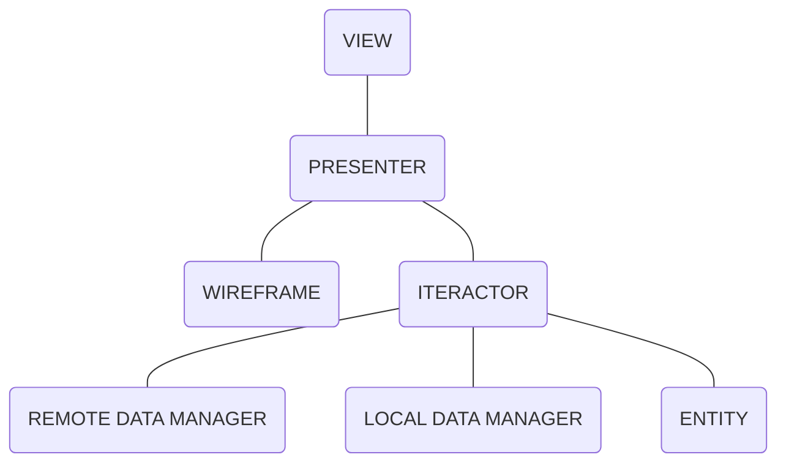
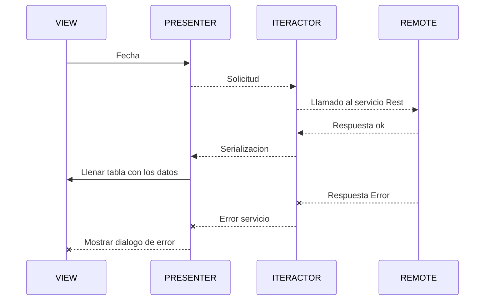

# Mercadolibre Mobile Candidate 

- El objetivo de esta etapa de la entrevista es desarrollar una app utilizando las APIs de Mercado
Libre, que le permita a un usuario ver los detalles de un producto.

- Para lograr esto, Mercado Libre posee APIs abiertas a la comunidad para que cualquier
  desarrollador las consuma y pueda tener búsquedas y compras en su aplicación.
  
  

## La app debería contar con tres pantallas:

**1.** Campo de búsqueda.
**2.** Visualización de resultados de la búsqueda.
**3.** Detalle de un producto.
Puedes entregar un listado y detalle de productos que sea puro texto, o un buscador con
imágenes, iconos y texto, y un detalle completo del producto, como el que se muestra en la
web.

> **El diseño es libre, así que tendremos en cuenta la adaptación de las pantallas a diferentes dispositivos.**

> **Arquitectura.**

> **Animaciones.**

> **Código limpio y buenas prácticas de programación.**

## ¿Qué debe contener la entrega?

**1.** Video del funcionamiento de la App.
**2.** Código fuente en un archivo zip o subido en repositorio (proveer url).
**3.** Si se usaron dependencias, explicar el porqué de su uso.

## ¡Nota!

>**Lo mencionado a continuación fue empleado en este proyecto, se podrá validar en la codificación y estructura de este**

## Arquitectura utilizada VIPER

VIPER es un acrónimo de **View**, **Interactor**, **Presenter**, **Entity** y **Router**. Esta arquitectura está basada en Principios de Responsabilidad Unica, que guía hacia una arquitectura más limpia, para tener una estructura mejor [VIPER]([https://apiumhub.com/es/tech-blog-barcelona/arquitectura-viper/](https://apiumhub.com/es/tech-blog-barcelona/arquitectura-viper/)). 

## Diagrama  UML 

La finalidad de los diagramas es presentar diversas perspectivas de un sistema, a las cuales se les conoce como modelo.

## Control de versiones GITFLOW 

El flujo de trabajo de Gitflow es un diseño de flujo de trabajo de Git que fue publicado por primera vez y popularizado por [Vincent Driessen en nvie](http://nvie.com/posts/a-successful-git-branching-model/). El flujo de trabajo de Gitflow define un modelo estricto de ramificación diseñado alrededor de la publicación del proyecto. Proporciona un marco sólido para gestionar proyectos más grandes.

## Clean Code: código limpio

Clean Code, o Código Limpio, es una filosofía de desarrollo de software que consiste en aplicar **técnicas simples que facilitan la escritura y lectura de un código**, volviéndolo más fácil de entender.

## Pruebas unitarias y TDD 

