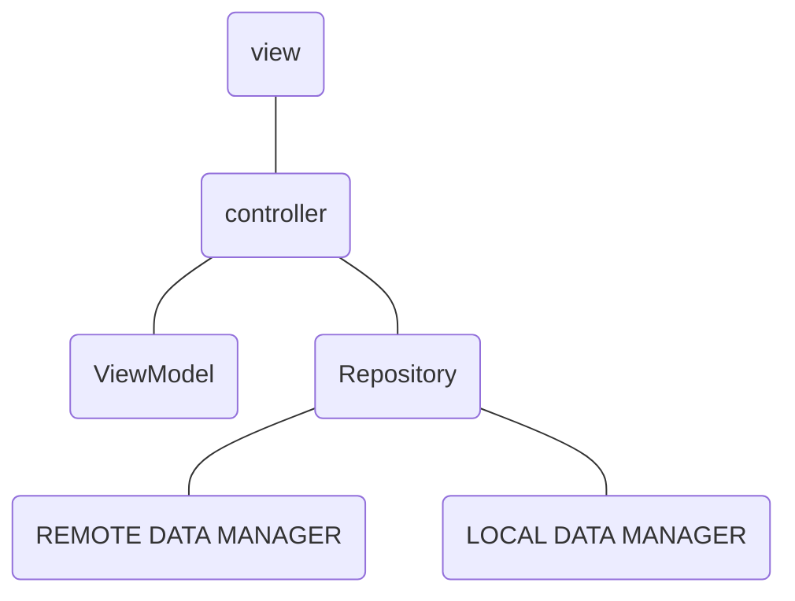
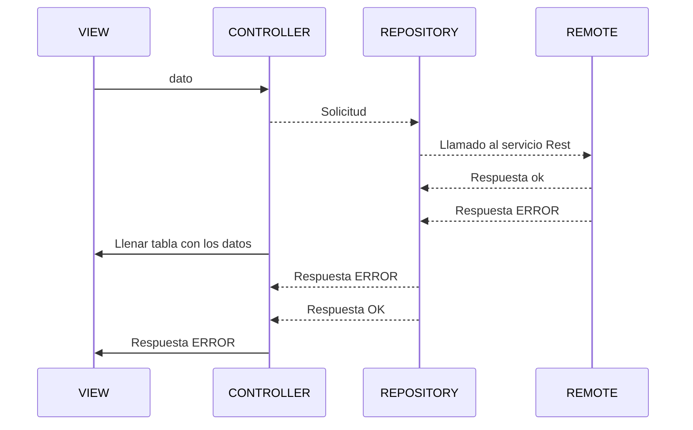

# Mercadolibre Mobile Candidate   
- El objetivo de esta etapa de la entrevista es desarrollar una app utilizando las APIs de Mercado  
Libre, que le permita a un usuario ver los detalles de un producto.  
  
- Para lograr esto, Mercado Libre posee APIs abiertas a la comunidad para que cualquier  
  desarrollador las consuma y pueda tener búsquedas y compras en su aplicación.  
    
    
## La app debería contar con tres pantallas:  
  
- Campo de búsqueda.  
- Visualización de resultados de la búsqueda.  
- Detalle de un producto.  
  
Puedes entregar un listado y detalle de productos que sea puro texto, o un buscador con  
imágenes, iconos y texto, y un detalle completo del producto, como el que se muestra en la  
web.  

## Requerimientos
Cada pantalla deberíamos poder rotarla y debería mantenerse el estado de la vista. 
- Entrega del proyecto: 
- Repositorio de código (GitHub público o similar). 
- Manejo de casos de error desde el punto de vista del developer. Cómo se gestionan los casos de error   inesperados, la consistencia a lo largo de toda la app, uso de logs, etc. 
- Manejo de casos de error desde el punto de vista del usuario. Priorizar una experiencia fluida dando feedback al usuario adecuadamente

## ¿Qué vamos a evaluar?

Vamos a ser los usuarios de tu producto y vamos a usar la app que desarrolles. Además vamos hacer una revisión del proyecto a nivel código donde vamos a enfocarnos en tu experiencia en la plataforma. Estos son algunos puntos que vamos a mirar: 

- Elección de patrones de diseño. 
- Guidelines oficiales de la plataforma. 
- Cómo aseguramos la calidad del proyecto (ej: tests unitarios). 
- Diseño óptimo de layouts. 
- Uso de la memoria (ej: memory leaks). 
- Legibilidad del código y documentación. 
- Experiencia del usuario. 
- Permisos del sistema operativo pedidos al usuario.

## ¡Nota!  
  
>**Lo mencionado a continuación fue empleado en este proyecto, se podrá validar en la codificación y estructura de este**  
  
## Arquitectura utilizada  
  
VIPER es un acrónimo de **View**, **Controller**, **Repository**, **Entity** y **r**. Esta arquitectura está basada en Principios de Responsabilidad Unica, que guía hacia una arquitectura más limpia
  

  
## Diagrama  UML   
La finalidad de los diagramas es presentar diversas perspectivas de un sistema, a las cuales se les conoce como modelo.  
  

  
## Control de versiones GITFLOW   
El flujo de trabajo de Gitflow es un diseño de flujo de trabajo de Git que fue publicado por primera vez y popularizado por [Vincent Driessen en nvie](http://nvie.com/posts/a-successful-git-branching-model/). El flujo de trabajo de Gitflow define un modelo estricto de ramificación diseñado alrededor de la publicación del proyecto. Proporciona un marco sólido para gestionar proyectos más grandes.  
  
  
  
  
## Clean Code: código limpio  
  
Clean Code, o Código Limpio, es una filosofía de desarrollo de software que consiste en aplicar **técnicas simples que facilitan la escritura y lectura de un código**, volviéndolo más fácil de entender.

## Implementación:
- Se implementaron pruebas unitarias en la carpeta test del proyecto
- Para manejar los log y casos de error se implementó la librería de **Crashlytics dashboard**
- Para la optimización de la memoria del dispositivo se utilizó **ViewModel** para el manejo de la información entre fragmentos 
